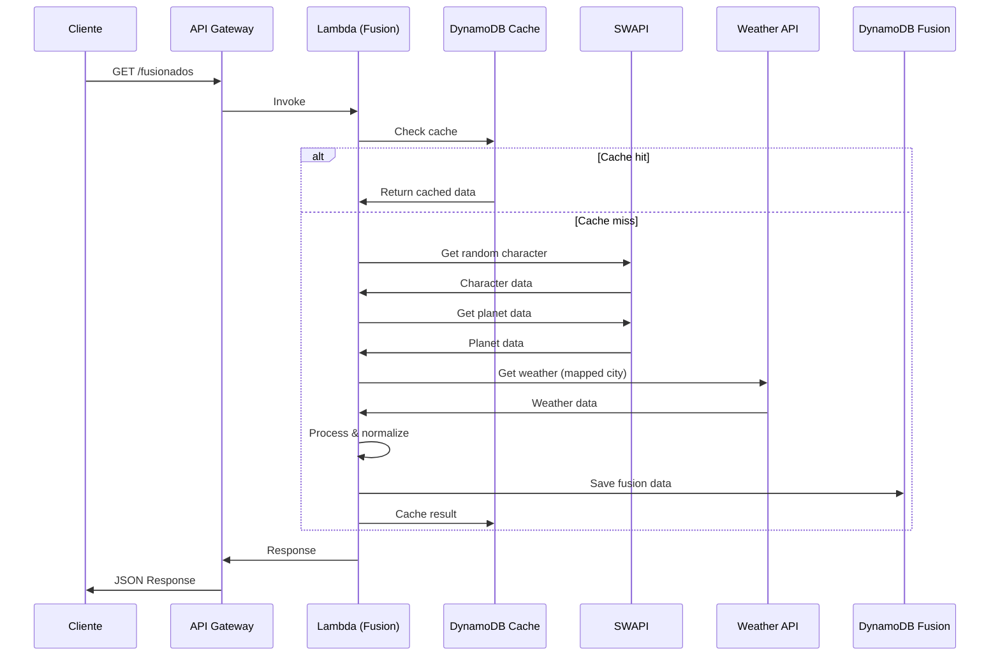
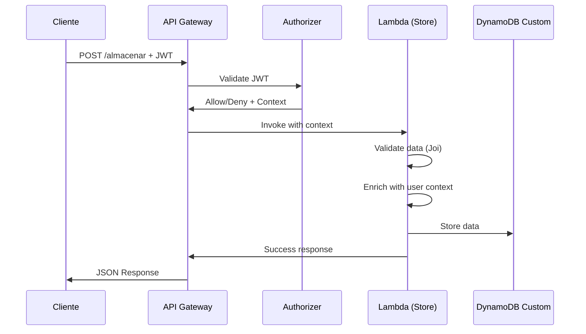

# Arquitectura de la Solución

## Descripción General

La API RESTful está construida con una arquitectura serverless usando AWS Lambda, diseñada para ser escalable, económica y mantenible. La solución integra múltiples servicios AWS y APIs externas para proporcionar un sistema robusto de fusión de datos.

## Componentes Principales

### 1. AWS Lambda Functions

#### a) getDatosFusionados (GET /fusionados)
- **Propósito**: Obtener y fusionar datos de SWAPI y OpenWeatherMap
- **Flujo**:
  1. Verificar caché en DynamoDB
  2. Si no hay caché, obtener datos de SWAPI
  3. Mapear planeta a ciudad terrestre
  4. Obtener datos meteorológicos
  5. Procesar y normalizar datos
  6. Calcular fusion score
  7. Guardar en DynamoDB
  8. Cachear resultado
- **Configuración**: 
  - Timeout: 30s
  - Memory: 256MB
  - Runtime: Node.js 20

#### b) almacenarDatos (POST /almacenar)
- **Propósito**: Almacenar datos personalizados del usuario
- **Seguridad**: Requiere autenticación JWT
- **Validación**: Esquemas Joi para validar estructura
- **Flujo**:
  1. Validar token JWT
  2. Validar estructura de datos
  3. Enriquecer con metadata del usuario
  4. Almacenar en DynamoDB

#### c) getHistorial (GET /historial)
- **Propósito**: Consultar historial paginado
- **Seguridad**: Requiere autenticación JWT
- **Características**:
  - Paginación eficiente
  - Filtrado por tipo (fusion/custom)
  - Ordenamiento cronológico descendente

#### d) authorizerFunc (JWT Authorizer)
- **Propósito**: Validar tokens JWT para endpoints protegidos
- **Flujo**:
  1. Extraer token del header Authorization
  2. Verificar firma y expiración
  3. Generar política IAM
  4. Proporcionar contexto de usuario

### 2. Amazon DynamoDB

#### a) Fusion Table
```
Estructura:
- id (S) - Hash Key
- timestamp (N) - GSI Hash Key
- character (M) - Datos del personaje
- planet (M) - Datos del planeta
- weather (M) - Datos meteorológicos
- fusionScore (N) - Puntuación calculada

GSI: TimestampIndex para consultas cronológicas
```

#### b) Custom Table
```
Estructura:
- id (S) - Hash Key
- timestamp (N) - GSI Hash Key
- data (M) - Datos del usuario
- metadata (M) - Metadatos y trazabilidad

GSI: TimestampIndex para consultas cronológicas
```

#### c) Cache Table
```
Estructura:
- cacheKey (S) - Hash Key
- data (M) - Datos cacheados
- ttl (N) - Time To Live (30 minutos)
- createdAt (N) - Timestamp de creación

TTL automático para expiración de caché
```

### 3. API Gateway

#### Configuración
- **CORS**: Habilitado para desarrollo web
- **Rate Limiting**: Configurado por AWS
- **Authorizers**: JWT personalizado para endpoints protegidos
- **Stages**: dev, staging, prod

#### Endpoints
```
GET  /fusionados     - Datos fusionados (público)
POST /almacenar      - Almacenar datos (protegido)
GET  /historial      - Consultar historial (protegido)
```

### 4. Servicios Externos

#### a) SWAPI (Star Wars API)
- **URL**: https://swapi.dev/api
- **Uso**: Obtener personajes y planetas de Star Wars
- **Rate Limiting**: Ninguno conocido
- **Failover**: Retry automático con backoff exponencial

#### b) OpenWeatherMap API
- **URL**: https://api.openweathermap.org/data/2.5
- **Autenticación**: API Key
- **Uso**: Datos meteorológicos por ciudad
- **Rate Limiting**: Según plan (1000 req/día gratis)

## Flujo de Datos

### 1. Flujo de Datos Fusionados



### 2. Flujo de Almacenamiento



## Patrones de Diseño Implementados

### 1. Service Layer Pattern
- Separación clara entre handlers y lógica de negocio
- Servicios reutilizables (SWAPIService, WeatherService, etc.)

### 2. Repository Pattern
- DynamoDBService como capa de abstracción de datos
- Métodos específicos para cada operación

### 3. Factory Pattern
- Creación de instancias de servicios
- Configuración centralizada

### 4. Strategy Pattern
- Diferentes estrategias de caché
- Mapeo flexible de planetas a ciudades

### 5. Chain of Responsibility
- Middleware de autenticación
- Validación en capas

## Consideraciones de Seguridad

### 1. Autenticación y Autorización
- JWT tokens con expiración
- Secrets seguros en AWS SSM/Secrets Manager (producción)
- Autorización granular por endpoint

### 2. Validación de Datos
- Validación de entrada con Joi
- Sanitización de strings
- Límites en payload size

### 3. Rate Limiting
- AWS API Gateway rate limiting
- Caché para reducir llamadas externas
- Timeout en requests externos

### 4. Seguridad de Red
- HTTPS en todas las comunicaciones
- CORS configurado apropiadamente
- Headers de seguridad

## Optimizaciones de Performance

### 1. Caché Estratégico
- TTL de 30 minutos para datos fusionados
- Caché distribuido con DynamoDB
- Invalidación automática

### 2. Paginación Eficiente
- Límites configurables
- Índices GSI para consultas rápidas
- Metadata de paginación

### 3. Optimización de Lambda
- Memoria optimizada (256MB)
- Timeout ajustado (30s)
- Reutilización de conexiones

### 4. Optimización de DynamoDB
- Pay-per-request para escalabilidad
- Índices GSI para consultas frecuentes
- TTL automático para limpieza

## Monitoreo y Observabilidad

### 1. CloudWatch Logs
- Logs estructurados en JSON
- Diferentes niveles (INFO, WARN, ERROR)
- Correlation IDs para trazabilidad

### 2. CloudWatch Metrics
- Métricas automáticas de Lambda
- Métricas personalizadas de negocio
- Alarmas para errores críticos

### 3. X-Ray Tracing (Bonus)
- Trazabilidad end-to-end
- Análisis de latencia
- Detección de cuellos de botella

## Consideraciones de Costo

### 1. Lambda
- Pay-per-invocation
- Optimización de memoria y timeout
- Cold start minimizado

### 2. DynamoDB
- Pay-per-request
- Sin sobreprovisioning
- TTL para limpieza automática

### 3. API Gateway
- Pay-per-request
- Caché para reducir invocaciones
- Compresión habilitada

### 4. APIs Externas
- Caché para minimizar llamadas
- Plan gratuito de OpenWeatherMap
- SWAPI es gratuito

## Escalabilidad

### 1. Horizontal
- Lambda escala automáticamente
- DynamoDB maneja millones de requests
- API Gateway sin límites fijos

### 2. Vertical
- Configuración de memoria ajustable
- Timeouts configurables
- Optimización por endpoint

### 3. Global
- Multi-región disponible
- CloudFront para CDN
- DynamoDB Global Tables

## Mantenimiento y Operaciones

### 1. CI/CD
- Scripts de despliegue automatizados
- Testing automático
- Rollback capabilities

### 2. Configuración
- Variables de entorno por stage
- Configuración externalizada
- Secrets management

### 3. Backup y Recovery
- Backups automáticos de DynamoDB
- Versionado de código
- Point-in-time recovery

Esta arquitectura proporciona una base sólida, escalable y mantenible que cumple con todos los requisitos del reto técnico mientras implementa las mejores prácticas de desarrollo serverless.
